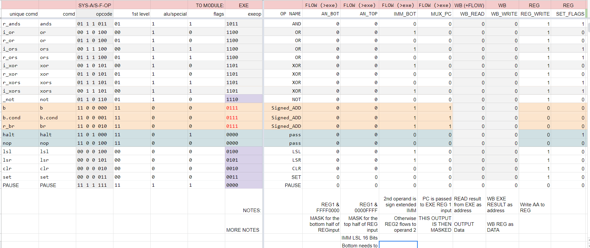

# Single Cycle Computer Instruction Decoder
Paul Kudyba  
11/2/22  

## Abstract
This project’s goal was to have the class split into 2 groups with one group tasked with producing testing for the single-cycle computer (SCC). The other group was tasked with producing a working CPU core (design team). The memory module was completed in a previous project.

## Introduction
This document covers details from the design team, specifically the decoder module. The core is a 32-bit single instruction per clock computer (a SCC). It is designed to implement a custom Instruction set architecture that was created by a previous computer architecture class. Details of the ISA and its design can be found in this repository under SCC.docx. The core components were completed on time. However, it required some debugging, which is to be completed as soon as possible.  
The completion of the core architecture and instruction decoder while keeping the design group on task and informed was a major component of the task that this document covers. Given the fast-paced timescale, the design team was further broken up into individual coding modules of the CPU core stages. The Instruction decode (ID) stage contributes a lot to the overall control of the CPU design. Therefore, it is a good fit for understanding this general SCC architectural design

## Methodology
The first step was to draw preliminary modules and define control signals for each module. This architecture design was implemented on paper and in a drawing program called Inkscape.  
Given the structure of the ISA, the core design was tentatively laid out. With this done, others in the group could better code their modules and understand the tasks they were to complete. Several revisions to the design architecture were made, and the team was informed promptly through discord and GroupMe. This allowed for feedback and discussion of the benefits and hiccups with the design logic.  
After the architectural design was drawn out, the logic of the instruction decoder could be implemented. This was done with Google Sheets. This also allowed the rapid collaboration and sharing of info with other group members.  
Due to a shortage of time, code was written to implement the major case structure of the instruction decoder with a python script that set each control signal output based upon the parsing of another spreadsheet derived from the previously mentioned Google Sheet. This python code created a case structure that switched on all the opcodes and set the appropriate control bits. The script also made use of the provided instructions.json file to create a header file which allowed for mapping each operational code to its functional name in the code.

## Results
The results are currently being tested and debugged. However, the core module and instruction memory work for most instructions. Thus far, the design team has produced a core ready for the testing group.  
While completing the code, it became clear that there were a few errors in the ISA and documentation. A list of errors found is provided as a log attached to this document.  
Also, relevant to the decode stage, it was necessary to indicate a signed operation of the immediate to be issued to the execute stage. This was indicated by passing a “0111” which was not a direct parsing of the opcode within the instruction received. Another relevant translation included a “pass” control signal to the EXE, which would pass the contents of its first operand to its results without affecting the value. This was only used if the instruction memory was disabled and gave a special opcode (“1111111”) which would effectively pause the core and not update the registers or program counter.  
The instruction decoder had a few errors, which, when addressed, allowed for the proper functioning of the core. This was easily achieved with a recompilation of the python script or a simple bit-swap in the resulting Verilog code.

Figure 1: A screenshot of the documentation shared with the group describing the decoded control signals and their intended effects.  
 
 

Figure 2: This is the design architecture of the core and its various control signals which was shared to the group to aid in the rapid development.
    
